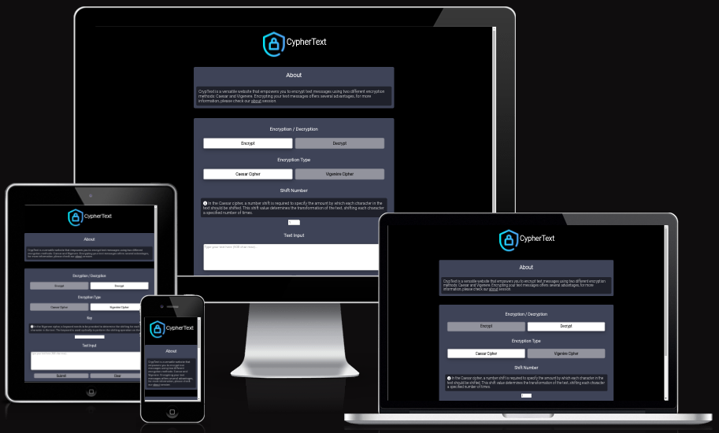
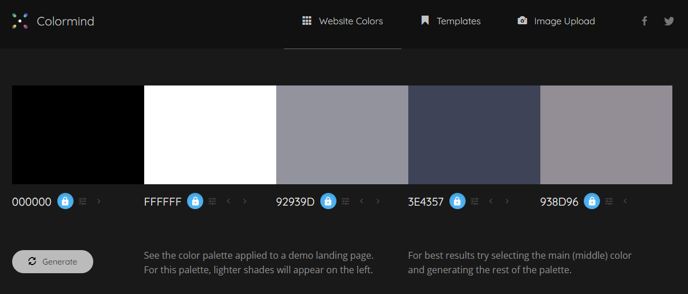
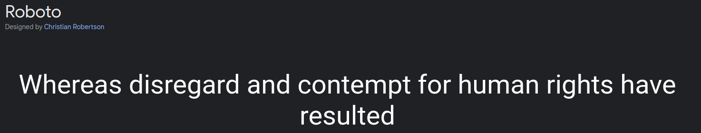
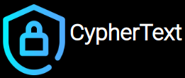
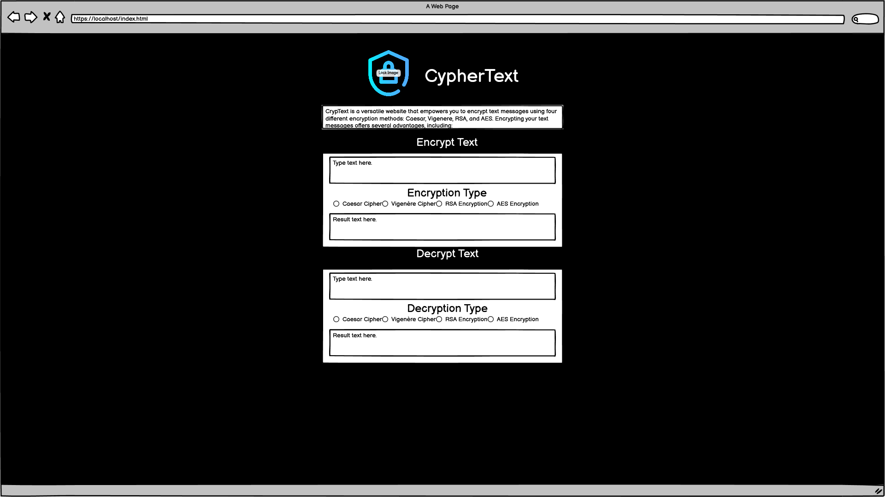
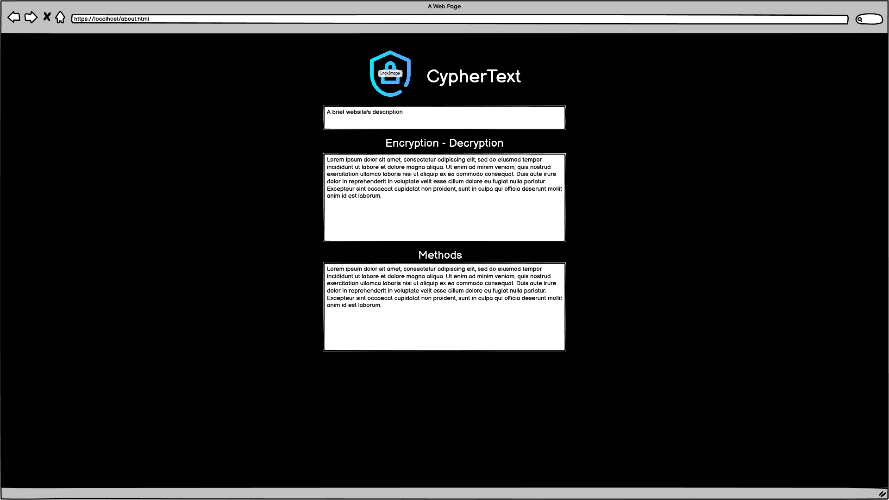

# CrypText Website

[View the live project here.](https://danvm94.github.io/cryptext/)

Cryptext is a versatile website that enables you to encrypt text messages using two different encryption methods: Caesar and Vigenere. The website provides a user-friendly interface where you can input your text and select the desired encryption method. Encrypting your text messages offers several advantages, including enhanced security and privacy. Cryptext simplifies the encryption process, allowing you to protect your messages with just a few clicks.

<h2 align="center"></h2>

## User Experience (UX)

- ### User stories

  - #### First Time Visitor Goals

    1. As a First Time Visitor, I want to easily understand the main purpose of the site and learn more about Cryptext.
    2. As a First Time Visitor, I want to be able to navigate through the site easily and find the desired information.
    3. As a First Time Visitor, I want to quickly find and use the encryption methods available.

  - #### Returning Visitor Goals

    1. As a Returning Visitor, I want to explore different encryption methods and discover their applications.
    2. As a Returning Visitor, I want to decrypt my previously encrypted texts.
    3. As a Returning Visitor, I want to check for any updates or new features added to Cryptext since my last visit.

  - #### Frequent User Goals
    1. As a Frequent User, I want to quickly encrypt texts using my preferred encryption method and settings.
    2. As a Frequent User, I want to experiment with different encryption keys or parameters to enhance my security.
    3. As a Frequent User, I want to easily share encrypted texts with others or recommend Cryptext to friends and colleagues.

- ### Design

  - #### Colour Scheme

    The colors palette used in this project was selected and viewed using the Colormind website.

    

    1.  `#000000`: This black colour is used as the background colour for the website, creating a sleek and modern look.
    2.  `#ffffff`: This pure white colour is used for text and content, ensuring clarity and readability.
    3.  `#92939d`: This medium grey colour is used for buttons and certain elements, adding contrast and a modern touch to the design.
    4.  `#3e4357`: This deep, dark blue is used as the background colour for the overall website, creating a sleek and sophisticated look.
    5.  `#938d96`: This muted grey colour is selectively used for specific elements to add detailed styling and enhance the overall design aesthetics.

  - #### Typography

    - The main font used for the website is "Roboto" from Google Fonts. It is a clean and modern sans-serif typeface that enhances the overall readability and visual appeal of the content.

    

  - #### Imagery

    - Imagery plays a vital role in capturing users' attention and creating an engaging visual experience on the Cryptext website. Both website pages feature a prominent top icon that includes an image of a lock and the text "CrypText". This visual element serves as the identity of the website and project, representing the focus on encryption and security. It provides a recognizable and cohesive branding throughout the website, reinforcing the purpose and theme of the project.

    

### Wireframes

Balsamiq Wireframe software was utilized to design the initial wireframe for the website, outlining the conceptual layout and structure. While some modifications were made during the development process, the wireframe served as a foundation for the final website design.

The wireframe visually represents the placement of various elements, such as navigation, content sections, and other components, providing a clear blueprint for the website's overall structure and user interface.

## Features

- Responsive Design: It is designed to be fully responsive, ensuring optimal viewing and functionality across various device sizes. Whether accessed from a desktop computer, tablet, or smartphone, users can enjoy a seamless and immersive experience.

- Interactive Elements: It incorporates interactive elements to enhance user engagement. Interactive forms and buttons, the website offers a dynamic and interactive interface, allowing users to easily interact with the encryption functionality and explore the content.

## Technologies Used

### Languages Used

- [HTML5](https://en.wikipedia.org/wiki/HTML5)
- [CSS3](https://en.wikipedia.org/wiki/Cascading_Style_Sheets)
- [Java Script](https://en.wikipedia.org/wiki/JavaScript)

### Frameworks, Libraries & Programs Used

1. [BEM Methodology:](https://getbem.com/introduction/)
   - BEM Methodology was used for structuring and organizing the CSS codebase, providing a modular and scalable approach to styling components.
1. [Google Fonts:](https://fonts.google.com/)
   - Google fonts were used to import the 'Titillium Web' font into the style.css file which is used on all pages throughout the project.
1. [Font Awesome:](https://fontawesome.com/)
   - Font Awesome was used on all pages throughout the website to add icons for aesthetic and UX purposes.
1. [Git](https://git-scm.com/)
   - Git was used for version control by utilizing the Gitpod terminal to commit to Git and Push to GitHub.
1. [GitHub:](https://github.com/)
   - GitHub is used to store the projects code after being pushed from Git.
1. [Balsamiq:](https://balsamiq.com/)
   - Balsamiq was used to create the [wireframes](https://github.com/) during the design process.
