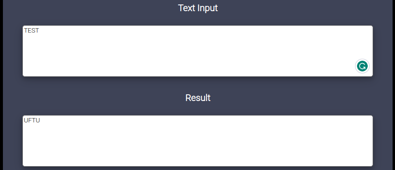
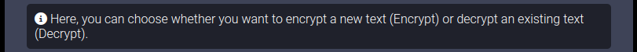
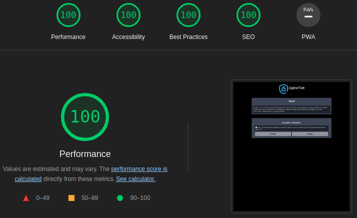
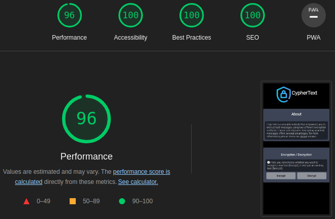
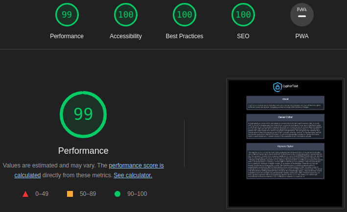
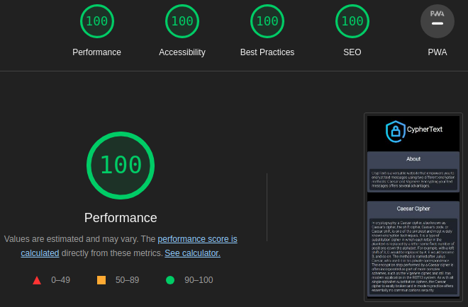
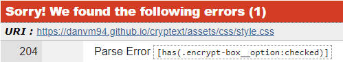
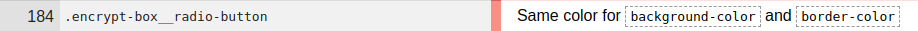
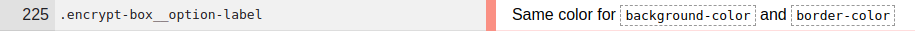

# CrypText Website

[View the live project here.](https://danvm94.github.io/cryptext/)

<h2 align="center"></h2>

<details>
  <summary>Table of Contents</summary>
  <ol>
    <li><a href="#description">Description</a></li>
    <li><a href="#features">Features</a></li>
    <li><a href="#usage">Usage</a></li>
    <li>
      <a href="#user-experience-(ux)">User Experience (UX)</a>
      <ul>
        <li><a href="#user-stories">User Stories</a></li>
        <li><a href="#design">Design</a></li>
      </ul>
    </li>
    <li>
      <a href="#technologies-used">Technologies Used</a>
      <ul>
        <li><a href="#languages-used">Languages Used</a></li>
        <li><a href="#frameworks-libraries--programs-used">Frameworks, Libraries & Programs Used</a></li>
      </ul>
    </li>
    <li>
      <a href="#testing">Testing</a>
      <ul>
        <li><a href="#code-testing">Code Testing</a></li>
        <li><a href="#lighthouse-testing">Light House Testing</a></li>
        <li><a href="#testing-user-stories-from-user-experience-ux-section">Testing User Stories from User Experience (UX) Section</a></li>
        <li><a href="#further-testing">Further Testing</a></li>
        <li><a href="#fixed-bugs">Fixed Bugs</a></li>
      </ul>
    </li>
    <li>
      <a href="#deployment">Deployment</a>
      <ul>
        <li><a href="#forking-the-github-repository">Forking the GitHub Repository</a></li>
        <li><a href="#github-pages">GitHub Pages</a></li>
        <li><a href="#making-a-local-clone">Making a Local Clone</a></li>
      </ul>
    </li>
    <li>
      <a href="#credits">Credits</a>
      <ul>
        <li><a href="#code">Code</a></li>
        <li><a href="#content">Content</a></li>
        <li><a href="#media">Media</a></li>
        <li><a href="#acknowledgmentes">Acknowledgements</a></li>
      </ul>
    </li>
  </ol>
</details>

## Description

Cryptext is a versatile website that enables you to encrypt text messages using two different encryption methods: Caesar and Vigenere. The website provides a user-friendly interface where you can input your text and select the desired encryption method. Encrypting your text messages offers several advantages, including enhanced security and privacy. Cryptext simplifies the encryption process, allowing you to protect your messages with just a few clicks.

## Features
- User-Friendly Interface: The project has a clean and intuitive user interface, making it easy for users to navigate and interact with the encryption options.


- Encryption Methods: Cryptext offers two encryption methods, Caesar and Vigenere, allowing users to encrypt their text messages using these popular encryption algorithms.


- Input and Output: Cryptext provides an input text area where users can enter their desired text to be encrypted. After selecting the encryption method and providing the necessary key or shift number, the project generates the encrypted result, which is displayed for the user to see.


- Clear Functionality: Cryptext includes a clear button that allows users to easily clear the input text and the encrypted result, providing a convenient way to start a new encryption process.


- Informative Text: Throughout the project, there are informative texts and descriptions that help users understand the purpose and usage of different encryption methods and input fields.


- Documentation: The project includes a detailed README.md file that provides an overview, instructions, and information about the project, making it easier for users to understand and use Cryptext.

- Responsive Design: The project is responsive and optimized for various device sizes, ensuring a seamless user experience across desktop, tablet, and mobile devices.

## Usage
Usage of the CryptText application typically involves the following steps:
1. Accessing the Application: Users can access the CryptText application by visiting the [website link](https://danvm94.github.io/cryptext/).

2. Selecting Encryption or Decryption: Upon accessing the application, users are presented with the option to choose between encryption or decryption. They can select either "Encrypt" or "Decrypt" based on their desired action.

3. Selecting Encryption Method: After choosing the encryption or decryption direction, users are then presented with options to select the encryption method. They can choose between Caesar or Vigenere encryption, depending on their specific requirements.

4. Entering Text: Once the encryption method is selected, users can enter the text they want to encrypt or decrypt. The application provides an input field where users can type or paste the desired text.

5. Providing Encryption Key: Depending on the chosen encryption method, users may need to provide an encryption key or shift number. This key determines the transformation applied to the text during encryption or decryption. Users can enter the key in the designated input field.

6. Performing Encryption or Decryption: After selecting the encryption direction, encryption method, encryption key or shift, and entering the input text, users can initiate the encryption or decryption process by clicking the submit button. The application processes the input text using the selected encryption method and displays the encrypted or decrypted result.

7. Clearing Input and Results: To start a new encryption or decryption process, users can utilize the clear button provided by the application. This action clears the input text field and the displayed results, allowing users to enter fresh input.
 
8. Exploring Additional Information: The CryptText application offers additional features and resources to enhance the user experience. Users can explore "About" section to learn more about the encryption methods.


## User Experience (UX)

- ### User Stories

  - #### First Time Visitor Goals

    1. As a First Time Visitor, I want to easily understand the main purpose of the site and learn more about Cryptext.
    2. As a First Time Visitor, I want to be able to navigate through the site easily and find the desired information.
    3. As a First Time Visitor, I want to quickly find and use the encryption methods available.

  - #### Returning Visitor Goals

    1. As a Returning Visitor, I want to explore different encryption methods and discover their applications.
    2. As a Returning Visitor, I want to decrypt my previously encrypted texts.
    3. As a Returning Visitor, I want to check for any updates or new features added to Cryptext since my last visit.

  - #### Frequent User Goals
    1. As a Frequent User, I want to experiment with different encryption keys or parameters to enhance my security.
    2. As a Frequent User, I want to easily share encrypted texts with others or recommend Cryptext to friends and colleagues.

- ### Design

  - #### Colour Scheme

    The colors palette used in this project was selected and viewed using the Colormind website.

    

    1.  `#000000`: This black colour is used as the background colour for the website, creating a sleek and modern look.
    2.  `#ffffff`: This pure white colour is used for text and content, ensuring clarity and readability.
    3.  `#92939d`: This medium grey colour is used for buttons and certain elements, adding contrast and a modern touch to the design.
    4.  `#3e4357`: This deep, dark blue is used as the background colour for the overall website, creating a sleek and sophisticated look.
    5.  `#938d96`: This muted grey colour is selectively used for specific elements to add detailed styling and enhance the overall design aesthetics.

  - #### Typography

    - The main font used for the website is "Roboto" from Google Fonts. It is a clean and modern sans-serif typeface that enhances the overall readability and visual appeal of the content.

    

  - #### Imagery

    - Imagery plays a vital role in capturing users' attention and creating an engaging visual experience on the Cryptext website. Both website pages feature a prominent top icon that includes an image of a lock and the text "CrypText". This visual element serves as the identity of the website and project, representing the focus on encryption and security. It provides a recognizable and cohesive branding throughout the website, reinforcing the purpose and theme of the project.

    

  - #### Wireframes

Balsamiq Wireframe software was utilized to design the initial wireframe for the website, outlining the conceptual layout and structure. While some modifications were made during the development process, the wireframe served as a foundation for the final website design.


The wireframe visually represents the placement of various elements, such as navigation, content sections, and other components, providing a clear blueprint for the website's overall structure and user interface.


## Technologies Used

### Languages Used

- [HTML5](https://en.wikipedia.org/wiki/HTML5)
- [CSS3](https://en.wikipedia.org/wiki/Cascading_Style_Sheets)
- [Java Script](https://en.wikipedia.org/wiki/JavaScript)

### Frameworks, Libraries & Programs Used

1. [BEM Methodology:](https://getbem.com/introduction/)
   - BEM Methodology was used for structuring and organizing the CSS codebase, providing a modular and scalable approach to styling components.
1. [Google Fonts:](https://fonts.google.com/)
   - Google fonts were used to import the 'Titillium Web' font into the style.css file which is used on all pages throughout the project.
1. [Font Awesome:](https://fontawesome.com/)
   - Font Awesome was used on all pages throughout the website to add icons for aesthetic and UX purposes.
1. [Git](https://git-scm.com/)
   - Git was used for version control by utilizing the Gitpod terminal to commit to Git and Push to GitHub.
1. [GitHub:](https://github.com/)
   - GitHub is used to store the projects code after being pushed from Git.
1. [Balsamiq:](https://balsamiq.com/)
   - Balsamiq was used to create the [wireframes](https://github.com/) during the design process.

## Testing

### Code Testing

The W3 HTML Validator and W3C CSS Validator Services were used to validate every page of the project to ensure there were no syntax errors in the project.

- [W3 HTML Validator](https://validator.w3.org/) - [Results](https://validator.w3.org/nu/?doc=https%3A%2F%2Fdanvm94.github.io%2Fpaulista-dishes%2F)
- [W3C CSS Validator](https://jigsaw.w3.org/css-validator/) - [Results](https://jigsaw.w3.org/css-validator/validator?uri=https%3A%2F%2Fdanvm94.github.io%2Fcryptext%2F&profile=css3svg&usermedium=all&warning=1&vextwarning=&lang=en)

### Lighthouse Testing

The Google Chrome built-in Lighthouse testing tool was utilized to assess the performance, accessibility, best practices and SEO aspects of the two available website pages. Below are the results obtained for each page, considering both the desktop and mobile versions.

#### index.html

##### Desktop



- [Full Report](https://danvm94.github.io/cryptext/readme/index-desktop.html)

##### Mobile



- [Full Report](https://danvm94.github.io/cryptext/readme/index-mobile.html)

#### about.html

##### Desktop



- [Full Report](https://danvm94.github.io/cryptext/readme/about-desktop.html)

##### Mobile



- [Full Report](https://danvm94.github.io/cryptext/readme/about-mobile.html)

### Testing User Stories from User Experience (UX) Section

- #### First Time Visitor Goals
  - As a First Time Visitor, I want to easily understand the main purpose of the site and learn more about Cryptext.
    1. Upon entering the CrypText website, users are immediately greeted with the prominent CrypText logo, which serves as the visual identity of the website. The CrypText logo is strategically positioned, and when clicked, it redirects users to the index.html (home page), providing a seamless and intuitive navigation experience. This allows users to easily return to the main page.
    2. Below the CrypText logo, users will find an informative "About" section that offers a comprehensive overview of the website's purpose and the available encryption methods, namely Caesar and Vigenere. Additionally, there is a link within the "About" section that redirects users to the about.html page, where they can find more detailed information about both encryption methods. This allows users to delve deeper into the concepts and gain a better understanding of how the encryption process works.
  - As a First Time Visitor, I want to be able to navigate through the site easily and find the desired information.
    1. The navigation is seamless and user-friendly, ensuring that users never feel trapped or lost within the site. At the top of every page, users will find the CrypText logo, which serves as a clickable link that redirects them back to the home page (index.html). This feature provides a convenient and intuitive way for users to navigate back to the main page of the website, ensuring easy access to the core content and functionality.
    2. Directly below the "About" section, you will find an interactive radio button selector. This user-friendly element allows users to choose between encryption direction, The options are accompanied by an informative text that provides guidance and clarification on the purpose and functionality of it.
  - As a First Time Visitor, I want to quickly find and use the encryption methods available.
    1. After selecting the encryption direction, user will be presented with two additional options to choose from. These options correspond to the encryption type, specifically Caesar and Vigenere. Similar to the previous selection, the options are accompanied by an informative text that assists users in making an informed decision. 
    2. After selecting the encryption direction and encryption type, users will be presented with four new interactive elements. 
    
    The first element allows users to enter the shift number (for Caesar encryption) or the encryption key (for Vigenere encryption). This interactive element is accompanied by informative text that explains its purpose and provides instructions on how to use it effectively.

    The second element is an input text area where users can enter the text they want to encrypt or decrypt. The input text area includes a placeholder text that guides users on what information they should enter.

    The third element is a submit button that triggers the website to process the provided information and generate the encrypted or decrypted text. The result will be displayed after the input text area.

    The fourth element is a clear button that allows users to easily clear all the text entered in the input text area and reset the encryption process.

    These interactive elements provide a user-friendly interface for seamless interaction and facilitate the encryption and decryption process.

- #### Returning Visitor Goals
  - As a Returning Visitor, I want to explore different encryption methods and discover their applications.
    1. Users can easily find information on how to use both encryption methods, Caesar and Vigenere, on the CrypText website. The instructions are available in two convenient locations.

    Firstly, on the main index.html page, users can navigate thru the Encryption buttons and select the available options where they will find comprehensive information about it.

    Secondly, users can access more in-depth information about the encryption methods on the about.html page. This dedicated page delves deeper into the intricacies of both Caesar and Vigenere encryption, providing additional examples, tips, and guidance for users who want a more thorough understanding.

- As a Returning Visitor, I want to decrypt my previously encrypted texts.
  1. Users can easily decrypt previously encrypted messages by navigating through the main page of the CrypText website.

- As a Returning Visitor, I want to check for any updates or new features added to Cryptext since my last visit.
  1. The available encryption methods are displayed straightforwardly after selecting the encryption direction.

- #### Frequent User Goals
  - As a Frequent User, I want to experiment with different encryption keys or parameters to enhance my security.
  1. Users can easily interact with the encryption key or text presented on the screen.
  - As a Frequent User, I want to easily share encrypted texts with others or recommend Cryptext to friends and colleagues.
  1. The user can easily check the encryption key they are using and view the encrypted message, which they can then share with others.

### Further Testing

- The Website was tested on Google Chrome, Internet Explorer, Microsoft Edge and Safari browsers.
- The website was viewed on a variety of devices such as Desktop, Laptop, iPhone7, iPhone 8 & iPhoneX.
- A large amount of testing was done to ensure that all pages were linking correctly.
- Friends and family members were asked to review the site and documentation to point out any bugs and/or user experience issues.

### Fixed Bugs

- During the CSS validator testing, an error and two warnings were found:
  1. <br />
  Parse Error - The error was related to the code ".encrypt-box__radio-button:has(.encrypt-box__option:checked)". This error occurred because the CSS validator does not recognize the ":has" function. Upon further investigation, it was found that Firefox does not support the ":has" function, which may have caused the warning message.
  To address this issue, a different approach was taken by modifying the HTML and CSS code. More details about the changes made can be found in this [git commit](https://github.com/Danvm94/cryptext/commit/6949db9b48c8b17cbdbd7626581cef47582f3ca7).
  
  2. <br />
  CSS class .encrypt-box__radio-button, indicating "Same color for background-color and border-color". This warning occurred because the background-color and border-color were initially set to the same value. The reason for this was to address the issue of size changing when applying the border properties after the :checked selector.
  To resolve this warning, a modification was made in this [git commit](https://github.com/Danvm94/cryptext/commit/c6cfe59a9d01f0403b78e4cc6fd195b9ed2f1e3e). The solution involved applying a transparent color to the border-color property, ensuring a distinct visual separation while maintaining the desired design.

  3. <br />
  CSS class .encrypt-box__radio-button, indicating "Same color for background-color and border-color". This warning occurred because the background-color and border-color were initially set to the same value. The reason for this was to address the issue of size changing when applying the border properties after the :checked selector.
  To resolve this warning, a modification was made in this [git commit](https://github.com/Danvm94/cryptext/commit/c6cfe59a9d01f0403b78e4cc6fd195b9ed2f1e3e). The solution involved applying a transparent color to the border-color property, ensuring a distinct visual separation while maintaining the desired design.

## Deployment

### Forking the GitHub Repository

By forking the GitHub Repository we make a copy of the original repository on our GitHub account to view and/or make changes without affecting the original repository by using the following steps...

1. Log in to GitHub and locate the [GitHub Repository](https://github.com/Danvm94/cryptext)
2. At the top of the Repository (not top of page) just above the "Settings" Button on the menu, locate the "Fork" Button.
3. You should now have a copy of the original repository in your GitHub account.

### GitHub Pages

The project was deployed to GitHub Pages using the following steps...

1. Log in to GitHub and locate your forked version of the "cryptext" project.
2. At the top of the Repository (not top of page), locate the "Settings" Button on the menu.
3. Scroll down the Settings page until you locate the "Pages" Section.
4. Under "Source", click the dropdown called "None" and select "Master Branch".
5. The page will automatically refresh.
6. Scroll back down through the page to locate the now published site link in the "Pages" section.

### Making a Local Clone

1. Log in to GitHub and locate the [GitHub Repository](https://github.com/)
2. Under the repository name, click "Clone or download".
3. To clone the repository using HTTPS, under "Clone with HTTPS", copy the link.
4. Open Git Bash
5. Change the current working directory to the location where you want the cloned directory to be made.
6. Type `git clone`, and then paste the URL you copied in Step 3.


```
$ git clone https://github.com/Danvm94/cryptext
```

7. Press Enter. Your local clone will be created.

```
$ git clone https://github.com/Danvm94/cryptext
> Cloning into `CI-Clone`...
> remote: Counting objects: 10, done.
> remote: Compressing objects: 100% (8/8), done.
> remove: Total 10 (delta 1), reused 10 (delta 1)
> Unpacking objects: 100% (10/10), done.
```
Click [Here](https://help.github.com/en/github/creating-cloning-and-archiving-repositories/cloning-a-repository#cloning-a-repository-to-github-desktop) to retrieve pictures for some of the buttons and more detailed explanations of the above process.

## Credits

### Code

- [BEM Methodology](https://getbem.com/introduction/): BEM Methodology was used for structuring and organizing the CSS codebase, providing a modular and scalable approach to styling components.

### Content

- The definition and explanation of the Caesar and Vigenere encryption methods were obtained from Wikipedia. You can access the articles through the following links:
  1. [Caesar cipher on Wikipedia](https://en.wikipedia.org/wiki/Caesar_cipher)
  2. [Vigenere cipher on Wikipedia](https://en.wikipedia.org/wiki/Vigen%C3%A8re_cipher)

- Psychological properties of colours text in the README.md was found [here](http://www.colour-affects.co.uk/psychological-properties-of-colours)

### Media

- [Pixabay](https://pixabay.com/): For sourcing free images, Pixabay was utilized as the image provider for this purpose to the entire website.

### Acknowledgements

- My Mentor for continuous helpful feedback.
- CodeInsitute Tutoring for their valuable tips on troubleshooting.
- CodeInstitute Slack community for their quick and supportive responses.